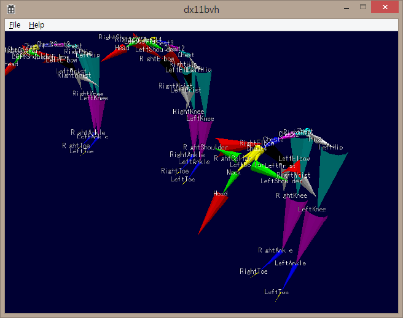

DirectX 11 BVH Viewer
=======

Very simple Biovision BVH viewer.

It also works as a simple example to show "Perfume" motions which distributed at http://www.perfume-global.com/ with DirectX.

## Compiling

* Visual Studio 2013 required.
* No need to install DirectX SDK.
* DIRECTXTK_DIR environment variable points to the location of the DirectXTK library. Please make sure that compile option of two projects match. (I prefer Multi-threaded (/MT) oprion to solve dependencies)
