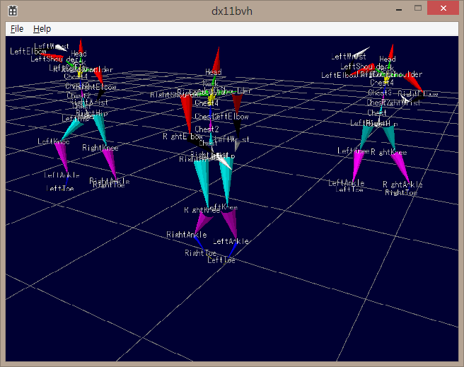

DirectX 11 BVH Viewer
=======

Very simple Biovision BVH viewer.

Visual Studio 2013 community required.
Before open the solution file, type below from Git Bash to get DirectXTK.

$ git submodule init

$ git submodule update

Then, open dx11bvh.sln and build it:)

## How to use

Drag-and-Drop .bvh file to view.
